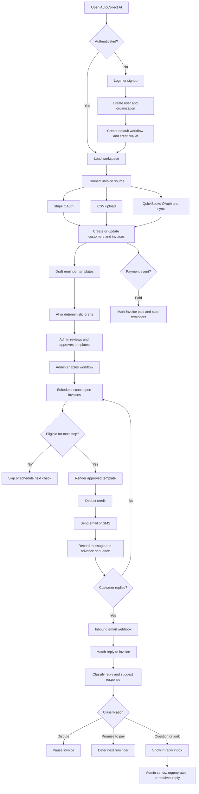

# AutoCollect AI: Product and System Analysis

**Document status:** Current-state analysis
**Date:** 2026-08-24

## 1. Product Summary

AutoCollect AI is a multi-tenant SaaS application for automated B2B invoice collection. It is designed for freelancers, agencies, and small businesses that need to follow up on unpaid invoices without manually sending repetitive reminders.

The core product promise is:

1. Import invoices from Stripe, CSV, or QuickBooks Online.
2. Generate polite, escalating reminder messages with AI.
3. Let an administrator review and approve the messages.
4. Automatically send reminders according to a workflow.
5. Include a one-click payment link.
6. Detect customer replies, classify them, and adapt the reminder sequence.
7. Stop reminders when an invoice is paid, paused, disputed, or otherwise resolved.

The documented MVP is locked to **Stripe + CSV sources, email-only communication, and approve-once then auto-send behavior**. The codebase already contains additional QuickBooks, SMS, subscription, credits, branding, members, admin, and demo capabilities.

## 2. Target Users

### Primary users

- Freelancers collecting client invoices.
- Small businesses with recurring B2B receivables.
- Agencies managing several customers and invoices.
- Operations or finance staff responsible for accounts receivable.

### User roles

- **Owner:** Organization owner with full administrative access.
- **Admin:** Can configure integrations, workflows, templates, billing, and invoice actions.
- **Member:** Can access permitted workspace information but cannot perform administrative actions.
- **Super admin:** Platform-level operator with access to the admin console.

## 3. High-Level Product Flow

## 4. Authentication and Workspace Flow

### Signup

1. User submits name, email, and password.
2. API validates email format and password complexity.
3. API rejects duplicate email addresses.
4. Password is stored as an Argon2 hash.
5. A user, tenant, membership, default workflow, and credit wallet are created.
6. Development mode verifies and logs the user in immediately.
7. Production mode creates an email verification token and sends a verification email through Postmark.

### Login

1. User submits email and password.
2. API finds the user and verifies the password hash.
3. API checks that the account is active.
4. API resolves the user’s organization membership.
5. API creates a database-backed session.
6. A session cookie is returned to the browser.
7. The frontend loads `/me` to obtain the user, tenant, role, plan, usage, templates, and credit balance.

### Password recovery

1. User submits an email address.
2. API always returns a generic response so account existence is not disclosed.
3. Existing reset tokens are invalidated.
4. A time-limited token is stored as a hash.
5. A reset link is sent through Postmark, or logged in development.
6. The user submits a new valid password.
7. The token is marked used and all existing sessions are invalidated.

### Email verification

1. User receives a time-limited verification link.
2. Frontend submits the token to the API.
3. API hashes and validates the token.
4. User email is marked verified and the token cannot be reused.

### Logout

1. User selects Sign out.
2. Frontend calls `/auth/logout`.
3. API deletes the current session.
4. API clears the session cookie.
5. Frontend navigates to the login screen and reloads workspace state.

## 5. Frontend Application Flow

The React SPA defines public and authenticated routes.

### Public routes

- `/login`
- `/signup`
- `/forgot-password`
- `/reset-password`
- `/verify-email`
- `/accept-invite`

### Authenticated routes

- `/dashboard`
- `/invoices`
- `/invoices/:id`
- `/customers`
- `/workflows`
- `/templates`
- `/replies`
- `/activity`
- `/settings`
- `/admin`

The authenticated shell calls `/me`. Unauthorized users are redirected to `/login`. Authenticated users receive a sidebar layout and workspace-aware navigation.

The frontend uses TanStack Query for server state, React Router for navigation, and a shared API client for JSON requests and session-cookie handling.

## 6. Invoice Ingestion Flow

### Stripe connection

1. Admin selects Stripe connection in Settings.
2. API generates signed OAuth state containing the tenant identity.
3. User completes Stripe Connect authorization.
4. API exchanges the authorization code for the connected account.
5. The connected Stripe account is stored against the tenant.
6. Stripe webhook events are verified using the Stripe signature.
7. The connected account identifies the owning tenant.
8. Invoice and customer data are upserted.
9. Duplicate webhook events are ignored using `webhook_events`.
10. `invoice.paid` changes the local invoice to `paid`.

Development mode provides a Stripe simulator that creates invoice and payment events without real Stripe credentials.

### CSV import

1. Admin uploads one CSV file.
2. API parses the file with `csv-parse`.
3. Common column aliases are automatically mapped.
4. Required values are validated: invoice number, amount, and customer name or email.
5. Amounts are converted to integer cents.
6. Customers are created or updated.
7. Invoices are created or updated using tenant, source, and external ID uniqueness.
8. The default workflow is assigned.
9. Plan invoice capacity is enforced per row.
10. The API returns imported rows, failed rows, total rows, and row-level errors.

CSV processing is intentionally partial: invalid rows do not prevent valid rows from being imported.

### QuickBooks Online

QuickBooks is implemented as an additional integration even though it is outside the locked MVP.

1. Admin starts QuickBooks OAuth.
2. Access and refresh tokens are encrypted before storage.
3. Manual or scheduled sync loads changed invoices.
4. Expired access tokens are refreshed.
5. QuickBooks customers and invoices are upserted.
6. The last sync timestamp is stored.
7. Failed syncs mark the integration as `error`.

## 7. Workflow and Template Flow

A workflow is a deterministic sequence of reminder steps. AI does not decide when messages are sent; it only drafts message content.

The default reminder sequence is:

| Step | Meaning | Typical timing |
|---|---|---:|
| `reminder_pre` | Courtesy reminder before due date | -2 days |
| `reminder_1d` | Invoice is due | +1 day |
| `reminder_7d` | Invoice is overdue | +7 days |
| `reminder_14d` | Firm overdue reminder | +14 days |

Setup flow:

1. Admin chooses or confirms the organization tone: friendly, professional, or firm.
2. Admin requests AI-generated templates.
3. Anthropic generates four drafts when configured.
4. Deterministic fallback drafts are used when Anthropic is unavailable.
5. Admin edits subjects and bodies if needed.
6. Admin approves each template.
7. Admin enables the workflow.
8. The application displays a setup warning until templates are approved and the workflow is enabled.

Templates use placeholders including:

- `{client_name}`
- `{amount}`
- `{due_date}`
- `{pay_link}`
- `{company_name}`
- `{invoice_number}`

The dunning engine refuses to send an unapproved or missing template.

## 8. Automated Dunning Flow

The scheduler scans open invoices whose workflow sequence has not completed.

For every candidate invoice, the engine:

1. Loads the invoice, customer, tenant, workflow, and current step.
2. Stops if the workflow is missing or disabled.
3. Stops if the invoice is no longer open.
4. Honors a promise-to-pay deferral date.
5. Calculates the step’s scheduled date from the invoice due date.
6. Stores the next scheduled date when the step is not yet due.
7. Loads the selected template.
8. Stops if the template is not approved.
9. Checks and deducts one tenant credit.
10. Renders the template with invoice and customer data.
11. Sends email through Postmark or SMS through Twilio when configured.
12. Records the outbound message.
13. Writes an audit event.
14. Advances `next_step_index`.
15. Schedules the next step or marks the sequence complete.

Manual invoice actions include:

- Pause
- Resume
- Mark paid
- Send now
- Generate payment link

## 9. Payment Link Flow

1. Admin requests a payment link for an invoice.
2. If a link already exists, it is reused.
3. In real Stripe mode, the API creates a Stripe Payment Link using the connected account.
4. In development mode, a mock payment URL is generated.
5. The link is saved to the invoice.
6. The link is rendered into future reminder messages.

## 10. Inbound Reply Flow

Postmark sends customer replies to `/inbound/postmark`.

1. API validates the inbound webhook token in production.
2. Duplicate `MessageID` values are ignored.
3. The original invoice is resolved using email thread references.
4. A mailbox hash invoice ID is used as a fallback.
5. The reply is classified as `dispute`, `promise`, `question`, or `junk`.
6. The classification and content are stored.
7. AI generates a suggested response.
8. Disputes pause the invoice.
9. Promises to pay defer the next reminder until the promise date.
10. The reply appears in the Replies inbox.
11. An admin can send the suggestion, regenerate it, write a custom reply, or resolve it without sending.

The deterministic development classifier uses keyword matching when Anthropic is unavailable.

## 11. Billing, Plans, and Credits

| Plan | Invoice limit | Seat limit | Monthly credits | White label |
|---|---:|---:|---:|---:|
| Starter | 50 | 1 | 50 | No |
| Growth | Unlimited | 3 | 500 | No |
| Pro | Unlimited | Unlimited | 2,000 | No |
| Agency | Unlimited | Unlimited | 10,000 | Yes |

Production plan upgrades use Stripe Checkout and Stripe webhooks. Development mode uses an internal callback flow.

Each automated outbound message consumes one credit. Credit state is stored in `credit_wallets`, and every change is recorded in `credit_transactions`.

Invoice capacity and seat capacity are checked before new resources are created.

## 12. Backend Architecture

The API is a Fastify application composed of route modules:

- Authentication and current-user state
- Health
- Stripe and CSV integrations
- QuickBooks integration
- Inbound email processing
- Invoices
- Workflows and templates
- Dashboard
- Activity
- Billing
- Replies
- Members
- Settings
- Cron jobs
- Demo data
- Super-admin console

The backend applies:

- Fastify Helmet security headers
- CORS restrictions
- Multipart file size limits
- Request body size limits
- Rate limiting
- Centralized error handling
- Redacted request logging
- Audit logging
- Role-based authorization

## 13. Tenant Isolation and Data Security

The tenant plugin authenticates each protected request and obtains a dedicated PostgreSQL connection.

The request context contains:

- Authenticated user
- Tenant ID
- User role
- Tenant-scoped database client

The API sets PostgreSQL session tenant context, and RLS policies restrict tenant-owned tables. The schema applies forced RLS to protect against accidental access through the normal runtime role.

Background operations use a separate service pool because they scan or update multiple tenants. Production configuration must ensure that service credentials are tightly controlled and correctly aligned with the intended RLS bypass model.

Credentials for QuickBooks are encrypted before storage. Authorization headers, cookies, and development identity headers are redacted from logs.

## 14. Jobs and Deployment Flow

### Long-running server

The API starts an in-process dunning scheduler. It periodically scans and processes open invoices.

### Serverless deployment

Vercel invokes `/api/cron/dunning` every five minutes. The endpoint:

1. Validates the cron secret.
2. Runs dunning for all eligible invoices.
3. Synchronizes active QuickBooks integrations.
4. Deletes expired sessions.
5. Returns processing counts.

### Local development

1. Start PostgreSQL with Docker Compose.
2. Install workspace dependencies.
3. Configure the API environment.
4. Run migrations.
5. Seed development data.
6. Start the API and web applications.

## 15. Data Model

Core entities:

- `tenants`: Organizations/workspaces.
- `users`: Login identities.
- `memberships`: User-to-tenant roles.
- `integrations`: Connected external systems.
- `customers`: Normalized customer records.
- `invoices`: Receivable records and dunning state.
- `workflows`: Reminder timing and channel configuration.
- `templates`: Human-approved message content.
- `messages`: Outbound send history.
- `replies`: Inbound customer replies and classifications.
- `webhook_events`: Webhook idempotency records.
- `audit_log`: User and system activity history.
- `subscriptions`: Billing subscription state.
- `credit_wallets`: Current tenant credit balance.
- `credit_transactions`: Credit ledger.

## 16. Current Strengths

- Clear vertical product workflow from invoice ingestion to payment collection.
- Human approval is required before automated messages can be sent.
- Tenant isolation is enforced at the database level with RLS.
- Passwords are hashed using Argon2.
- Reset and verification tokens are stored as hashes.
- Webhook idempotency is implemented.
- Stripe webhook signatures are verified.
- QuickBooks credentials are encrypted.
- Role-based administrative controls exist.
- Rate limiting, Helmet, body limits, and redacted logging are present.
- AI and external providers have local deterministic fallbacks.
- Audit events are recorded for important actions.
- The main tenant flows have Playwright smoke coverage.

## 17. Production Gaps and Risks

### 17.1 Provider send idempotency

The engine sends to Postmark or Twilio before inserting the local message record. If the provider accepts the message and the process crashes before the database insert, a later scan can send a duplicate.

Recommended improvement: introduce an outbound-message state machine with reservation, provider idempotency keys where supported, retry state, and reconciliation.

### 17.2 Credit and send transaction boundary

Credit deduction, provider sending, message insertion, and invoice advancement are not one atomic transaction. Concurrent jobs or provider failures can create inconsistent credit and message state.

Recommended improvement: reserve credits and create an outbound job transactionally, then process provider delivery from a durable queue.

### 17.3 In-process scheduler reliability

An in-process scheduler is vulnerable to process restarts, overlapping instances, deployment interruptions, and duplicate concurrent scans.

Recommended improvement: use a durable job system such as Inngest or a queue-backed worker with leases, locking, retries, and dead-letter handling.

### 17.4 Webhook processing states

Webhook idempotency exists, but webhook records do not fully represent processing status, retry count, error details, or dead-letter state.

Recommended improvement: add received, processing, processed, and failed states with structured retry metadata.

### 17.5 AI output validation

AI responses are parsed and minimally checked. Production validation should also enforce:

- Required placeholder preservation.
- Subject and body length limits.
- Safe content rules.
- No unexpected links or recipient changes.
- Reliable JSON schema validation.
- Prompt-injection resistance for inbound customer content.
- Human review for low-confidence classifications.

### 17.6 Authorization consistency

Administrative actions are role-protected, but every new route and integration callback should be reviewed for tenant ownership, replay protection, and least privilege.

### 17.7 Database service-role exposure

Cross-tenant background processing depends on `SERVICE_DATABASE_URL`. This credential must be isolated, rotated, monitored, and unavailable to frontend or ordinary application processes.

### 17.8 Data retention and privacy

The product stores invoice data, customer contact information, message content, and inbound replies. Retention, deletion, export, consent, and regional privacy requirements need explicit policies.

### 17.9 Operational visibility

The code has logs and an error webhook, but production operation would benefit from metrics and dashboards for:

- Invoices processed.
- Messages attempted, sent, bounced, and failed.
- Provider latency.
- Credit exhaustion.
- Webhook failures.
- Scheduler lag.
- AI failures and fallback usage.
- Tenant-level activity.

### 17.10 Documentation mismatch

The README describes the web application on port `5173`, while Playwright uses port `5175`. Development documentation and configuration should use one consistent port.

## 18. Recommended Implementation Order

### Phase 1: Product correctness

1. Validate every public and administrative route.
2. Complete login, signup, reset, verification, invite, and logout error states.
3. Standardize frontend and API environment configuration.
4. Add focused API tests for authorization and tenant isolation.
5. Add invoice, workflow, template, reply, and billing edge-case tests.

### Phase 2: Reliable collection engine

1. Add durable outbound message reservations.
2. Add job leases and concurrency control.
3. Make credit reservation and send state transitions recoverable.
4. Add provider retry and failure handling.
5. Add delivery/bounce event processing.
6. Add scheduler lag and send failure metrics.

### Phase 3: Integration hardening

1. Harden Stripe OAuth state and callback replay handling.
2. Add Stripe event reconciliation.
3. Add QuickBooks token lifecycle tests.
4. Add CSV import preview and downloadable error report.
5. Add integration disconnect and credential rotation flows.

### Phase 4: AI and reply safety

1. Add strict schemas for AI output.
2. Validate placeholders and content limits.
3. Add confidence thresholds and manual review rules.
4. Redact sensitive content from logs.
5. Add AI usage, latency, and fallback metrics.

### Phase 5: SaaS operations

1. Add subscription lifecycle reconciliation.
2. Add credit renewal and failed-payment handling.
3. Add tenant suspension behavior.
4. Add data export and deletion workflows.
5. Add privacy, terms, and consent surfaces.
6. Add production runbooks and rollback procedures.

## 19. Overall Assessment

AutoCollect AI has a coherent and valuable core workflow:

`tenant -> invoice source -> invoice -> approved workflow -> scheduled reminder -> reply classification -> payment or resolution`

The current codebase is a functional MVP with several thoughtful production foundations. The most important next step is to make outbound sending durable and recoverable. That change will protect the product from duplicate reminders, lost credit state, scheduler restarts, and inconsistent invoice progression as usage grows.
